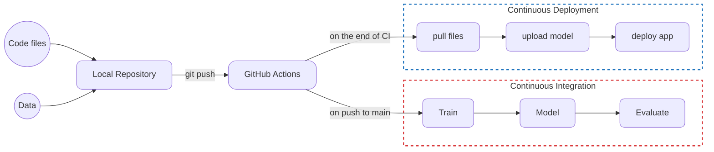

# 🏥 Drug Classification ML Pipeline

A production-ready machine learning system that predicts appropriate medications based on patient health metrics. This project demonstrates a complete CI/CD workflow for ML applications, from model training to automated deployment.

---

## 🎯 Project Overview

This intelligent drug recommendation system uses machine learning to predict the most suitable medication for patients based on their clinical data. The model achieves **97% accuracy** and is deployed through an automated CI/CD pipeline with GitHub Actions.

**Key Features:**
- 🤖 **High-Performance ML Model**: Random Forest classifier with 97% accuracy
- 🚀 **Automated CI/CD Pipeline**: Continuous training and deployment via GitHub Actions
- 🎨 **Interactive Web Interface**: Gradio-based UI for easy predictions
- 📊 **Robust Data Pipeline**: Feature preprocessing with encoding and scaling
- 📈 **Model Versioning**: Serialized model storage using skops

---

## 📊 Model Performance

| Metric | Score |
|--------|-------|
| **Accuracy** | 97% |
| **F1 Score** | 0.92 |

### Confusion Matrix


---

## 🛠️ Tech Stack

- **Machine Learning**: scikit-learn, pandas, numpy
- **Model Serialization**: skops
- **Frontend**: Gradio
- **CI/CD**: GitHub Actions
- **Code Quality**: Black (auto-formatting)

---

## 📁 Project Structure

```
├── train.py                    # ML pipeline training script
├── App/
│   └── app.py                 # Gradio web interface
├── Data/
│   └── drug200.csv            # Clinical patient dataset
├── Model/
│   └── drug_pipeline.skops    # Trained model artifact
├── Results/
│   ├── metrics.txt            # Model evaluation metrics
│   └── model_results.png      # Confusion matrix visualization
├── notebook.ipynb             # Exploratory data analysis
├── requirements.txt           # Python dependencies
├── Makefile                   # Build automation
└── README.md                  # This file
```

---

## 🚀 Quick Start

### Prerequisites
- Python 3.8+
- pip or conda

### Installation

```bash
# Clone the repository
git clone https://github.com/yourusername/CI-CD-ML.git
cd CI-CD-ML

# Create virtual environment
python -m venv venv
source venv/bin/activate  # On Windows: venv\Scripts\activate

# Install dependencies
pip install -r requirements.txt
```

### Training the Model

```bash
python train.py
```

This will:
1. Load and shuffle the drug dataset
2. Create train/test split (70/30)
3. Build preprocessing pipeline with feature encoding and scaling
4. Train RandomForestClassifier
5. Evaluate model performance
6. Save trained model to `Model/drug_pipeline.skops`
7. Generate confusion matrix visualization

### Running the Web Application

```bash
cd App
python app.py
```

Navigate to `http://localhost:7860` to interact with the model through the Gradio interface.

---

## 🔄 CI/CD Pipeline

This project features a fully automated CI/CD workflow:



**Workflow:**
1. **Continuous Integration**: On every push to main, GitHub Actions automatically trains the model and runs evaluation
2. **Continuous Deployment**: Upon successful training, the updated model is deployed to production
3. **Automated Monitoring**: Performance metrics are tracked and stored

---

## 📋 Dataset Features

The model predicts drug recommendations based on:
- **Age**: Patient age (15-74 years)
- **Sex**: Male or Female
- **Blood Pressure**: HIGH, LOW, or NORMAL
- **Cholesterol**: HIGH or NORMAL
- **Na_to_K**: Sodium to potassium ratio (6.2-38.2)

---

## 🔍 Model Architecture

The machine learning pipeline includes:

1. **Preprocessing Stage**:
   - Categorical features: OrdinalEncoder
   - Numerical features: SimpleImputer (median strategy) + StandardScaler

2. **Classification Stage**:
   - RandomForestClassifier (10 estimators)
   - Multi-class classification

---

## 📚 Key Files

- **`train.py`**: Complete ML pipeline implementation
- **`App/app.py`**: Interactive Gradio interface for model predictions
- **`notebook.ipynb`**: Data exploration and analysis
- **`Makefile`**: Automation commands
- **`report.md`**: Detailed model evaluation results

---

## 🎓 Learning Outcomes

This project demonstrates proficiency in:
- ✅ End-to-end ML pipeline development
- ✅ Feature engineering and preprocessing
- ✅ Model training and evaluation
- ✅ CI/CD automation with GitHub Actions
- ✅ Web application deployment
- ✅ Model versioning and artifact management

---

## 📞 Contact & Portfolio

This project showcases practical machine learning engineering skills suitable for production environments. Perfect for demonstrating:
- MLOps expertise
- Automated workflow design
- Python development
- Data science capabilities

---

## 📝 License

This project is open source and available under the MIT License.

---

**Built with ❤️ for production ML systems**