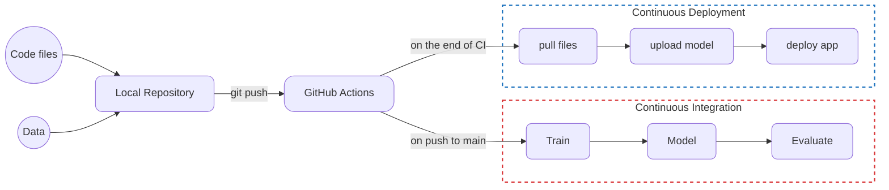

# CI-CD-ML

```mermaid
graph LR
    %% Node Definitions
    CodeFiles((Code files))
    Data((Data))
    LocalRepo[Local Repository]
    GHA[GitHub Actions]

    %% Left Side Connections
    CodeFiles --> LocalRepo
    Data --> LocalRepo
    LocalRepo -- "git push" --> GHA

    %% Continuous Integration Subgraph (Red Dashed Box)
    subgraph CI [Continuous Integration]
        Train[Train] --> Model[Model]
        Model --> Evaluate[Evaluate]
    end

    %% Continuous Deployment Subgraph (Blue Dashed Box)
    subgraph CD [Continuous Deployment]
        PullFiles[pull files] --> UploadModel[upload model]
        UploadModel --> DeployApp[deploy app]
    end

    %% GitHub Actions Orchestration
    GHA -- "on push to main" --> Train
    GHA -- "on the end of CI" --> PullFiles

    %% Custom Styling to Match Image
    style CI fill:none,stroke:#d9383a,stroke-width:2px,stroke-dasharray: 5 5
    style CD fill:none,stroke:#1e73be,stroke-width:2px,stroke-dasharray: 5 5
    style LocalRepo rx:10,ry:10
    style GHA rx:15,ry:15
    style Train rx:8,ry:8
    style Model rx:8,ry:8
    style Evaluate rx:8,ry:8
    style PullFiles rx:8,ry:8
    style UploadModel rx:8,ry:8
    style DeployApp rx:8,ry:8
```